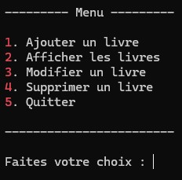

# Bibliothèque de livres (CRUD)

## Aperçu de l'application

Menu principal de l'application console :

  

## Description

Ce projet est une application console développée en C#.
Il permet de gérer une petite bibliothèque de livres avec les opérations CRUD.

L'objectif principal est de pratiquer sur :

* Des notions essentielles de développement **back-end**
* L'utilisation de **Git** pour la gestion de version

## Fonctionnalités

* Afficher un menu interactif
* Ajouter un livre
* Afficher la liste des livres
* Rechercher un livre
* Modifier un livre
* Supprimer un livre

## Technologies utilisées

* C#
* Visual Studio
* Git
* Git Bash

## Objectif pédagogique

Ce projet a été réalisé dans le but de s'entraîner à :

* Structurer un programme en procédural
* Manipuler des structures de données (Liste et Dictionnaire)
* Utiliser Git pour suivre l'évolution du code

## Auteur

Projet réalisé par Médéric KOTTO MOUYEMA 

## Amélioration Prévues 

* Gestion des erreurs de saisies utilisateurs
* Refactorisation avec POO  
