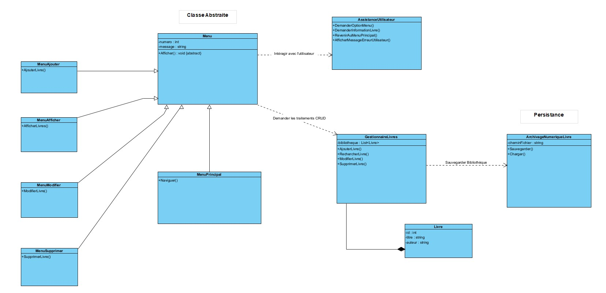

# Bibliothèque de livres (CRUD)

## Aperçu de l'application

Menu principal de l'application console :

  

## Description

Ce projet est une application console développée en C#.
Il permet de gérer une bibliothèque de livres via les traitements CRUD.

## 📊 Diagramme de classes

Le diagramme ci-dessous illustre la structure de l'application et la séparation des responsabilités entre les différentes couches.

## Fonctionnalités

* Afficher un menu interactif
* Ajouter un livre
* Afficher la liste des livres
* Rechercher un livre
* Modifier un livre
* Supprimer un livre

## Technologies utilisées

* .NET (C#, Visual Studio)
* Git
* Git Bash

## Objectifs pédagogiques

Ce projet a été réalisé dans le but de s'entraîner à :

* Pratiquer sur des notions essentielles de développement **back-end**
* Structurer un programme en procédural
* Manipuler des structures de données (Liste et Dictionnaire)
* Utiliser Git pour suivre l'évolution du code

## Auteur

Projet réalisé par Médéric KOTTO MOUYEMA 

## Améliorations réalisées 

* Refactorisation globale du code  
* Passage du programme en programmation orientée objet (POO)  
* Développement en couches  
* Gestion des saisies utilisateur  
* Amélioration de l’expérience utilisateur (UX)  
* Mise en place de la persistance des données :
  * Sauvegarde et lecture via fichier texte
  * Migration vers un format JSON
* Rechargement automatique des données au lancement de l’application  
* Ajout de la fonctionnalité : emprunter un livre
* Ajout de la fonctionnalité : rendre un livre

